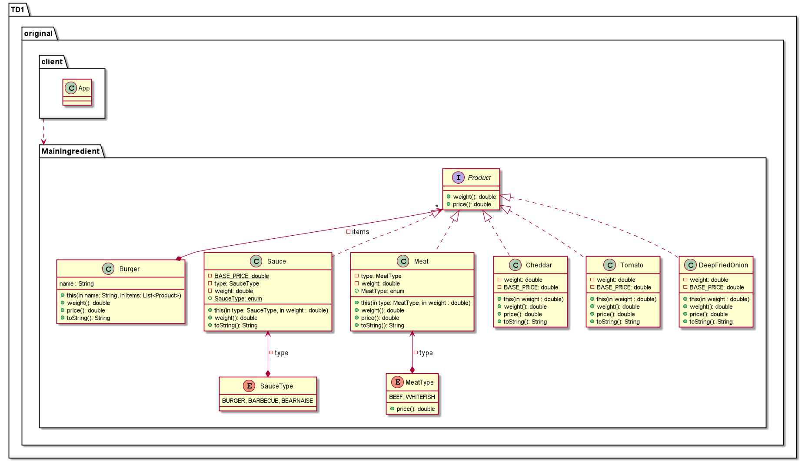
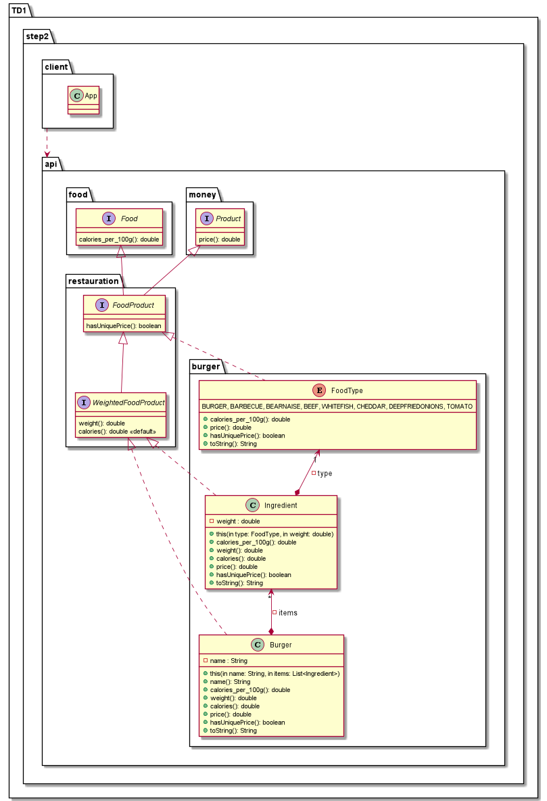
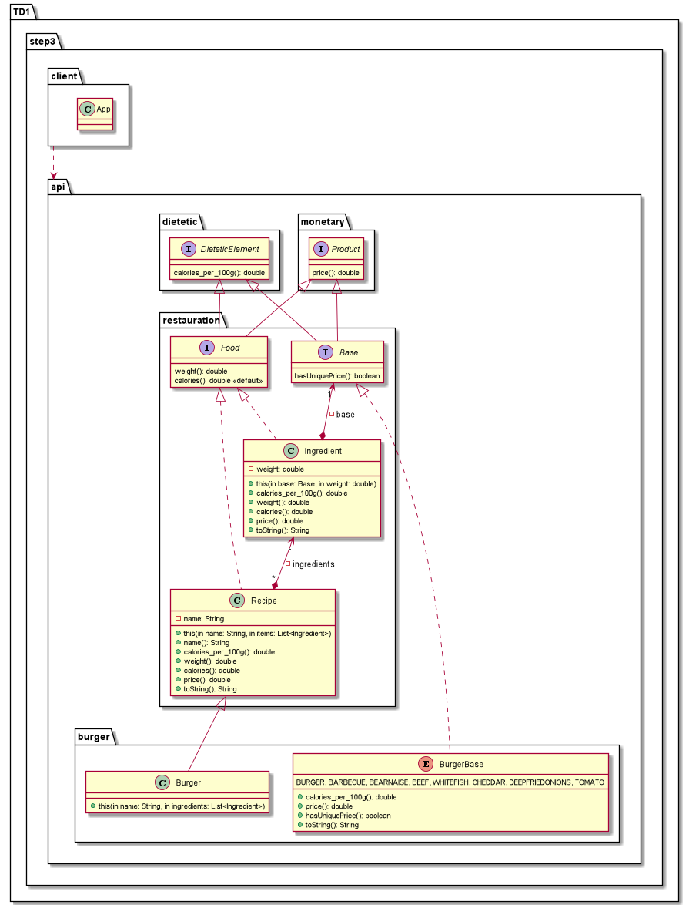
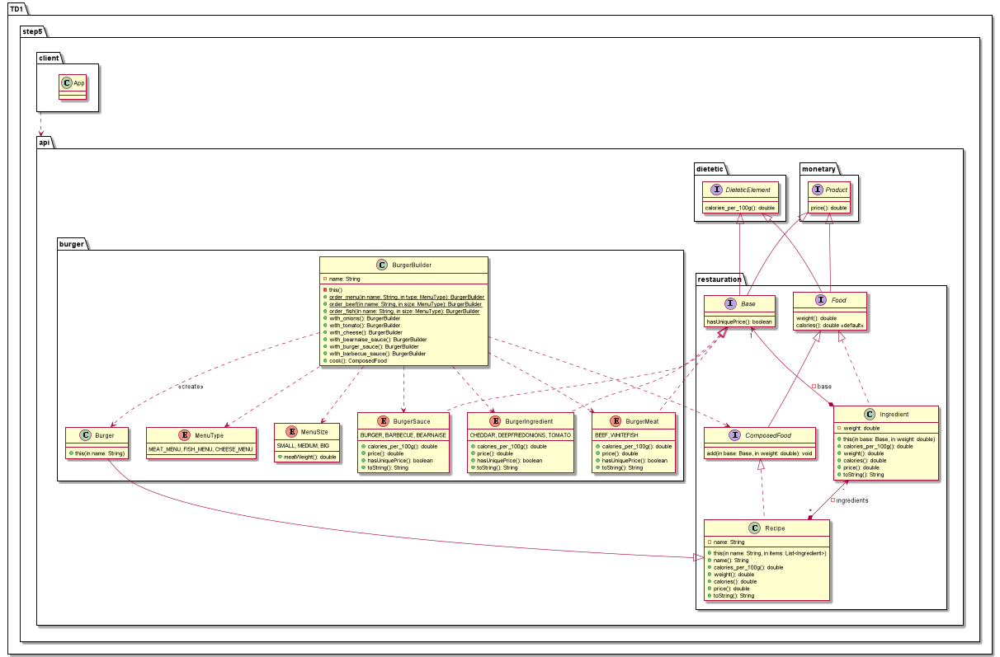

# mapc
Les TD de mapc

## TD1

__TD1 Original__

__TD1 Step1__

__TD1 Step2__

__TD1 Step3__

__TD1 Step4__

__TD1 Step5__

__TD1 Refactoring (PlantUml Not finished)__

## TD2

__TD2 Exercice 2.1__

__TD2 Exercice 2.3__

